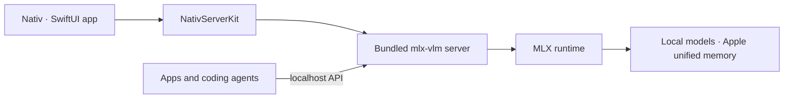

<p align="center">
  
</p>

<h1 align="center">Nativ</h1>

<p align="center">
  <strong>Local AI, native to your Mac.</strong>
</p>

<p align="center">
  Chat, serve, monitor, and connect MLX models from one macOS app.
</p>

<p align="center">
  
  
  
  
</p>

Nativ is a native macOS workspace for running AI models locally on Apple silicon. It bundles an [`mlx-vlm`](https://github.com/Blaizzy/mlx-vlm) server, finds compatible models in your Hugging Face cache (honoring `HF_HUB_CACHE` and `HF_HOME`), and wraps the whole experience in a polished SwiftUI app.

Use Nativ as a private chat app, a model manager, a performance dashboard, or an OpenAI- and Anthropic-compatible local inference server for the tools you already use.

## Documentation

Full feature and contributor documentation lives in **[`Docs/`](Docs/README.md)** — start there for
[Chat](Docs/features/chat.md), [Models](Docs/features/models.md), [Voice](Docs/features/voice.md),
[Scheduled tasks](Docs/features/routines.md), [Integrations](Docs/features/integrations.md), and the
[Developer](Docs/features/developer.md) reference, plus guides for
[extensions](Docs/extending/extensions.md), [kits](Docs/extending/kits.md), and the
[MCP catalog](Docs/extending/mcp-catalog.md).

## What Nativ can do

| Feature | What you get |
|---|---|
| **Local chat and vision** | Streaming conversations, image attachments, reasoning output, response metrics, and persistent chat history. |
| **Multiple windows** | Open independent workspaces with Command + Shift + N while sharing the same inference server, loaded models, and settings. |
| **Image generation and editing** | Generate and edit images locally with compatible MLX image models in a dedicated Images tab. |
| **Model library** | Discover installed MLX models, browse and download compatible models from Hugging Face with fit warnings for your memory, store the cache on an external APFS drive, inspect capabilities, switch models, or remove old ones. Preload separate language, image-generation, speech, and embedding models at once, with a warning if the combination would exceed your Mac's memory. |
| **Performance analytics** | Track request volume, token usage, time to first token, decode speed, model performance, and recent activity. |
| **System monitor** | Inspect live per-core CPU load, GPU utilization, unified memory and swap pressure, disk throughput, capacity, SMART health, and thermal and power sensors. |
| **Local APIs** | OpenAI-compatible chat, Responses, image, audio, embeddings, and model endpoints, plus Anthropic Messages endpoints. |
| **Coding-tool integrations** | Configure and launch terminal coding agents — Codex, Claude Code, Pi, Hermes, OpenCode, Aider, Goose, Crush, Qwen Code, OpenClaw — and set up editors — VS Code, Cursor, Zed, JetBrains, Cline, Continue — against models served by Nativ. See [Docs/features/integrations.md](Docs/features/integrations.md) for per-tool setup. |
| **Developer workspace** | Set the server host and port, add a Hugging Face token for gated models, inspect runtime details, copy endpoint URLs, search and filter live server logs, and monitor server health. |
| **Menu bar controls** | Start or stop the server, change the loaded model, check serving statistics, open the main app without breaking focus, or pin multiple live CPU, GPU, and RAM percentages and mini graphs. |
| **Extension platform** | Install, disable, remove, and restore independently versioned capabilities. Audio ships as the first included extension and contributes its own pages, commands, shortcuts, settings, and permission declarations. |
| **Audio extension** | Use private local audio capabilities, including voice dictation in any app with either a pointer-following waveform or a camera-cutout pill with a reactive gradient orb and timer. Review transcript history, track words per minute, total words, time saved, and streaks, choose an installed speech model, and customize the record and retry shortcuts. |
| **Artifacts** | Browse every image and document produced or uploaded across chats, with filters, sorting, and semantic search over your own artifacts. |
| **MCP servers** | Connect Model Context Protocol servers and expose their tools to chat, with per-tool consent. |
| **Scheduled** | Run saved prompts on a schedule with task-specific kits, MCP servers, tools, and skills. |
| **Chat tools** | Let the model generate and edit images, list or switch models, and read server and system stats, each behind a consent prompt. |
| **Advanced inference controls** | Tune sampling, thinking budgets, structured output, KV-cache quantization, prefix caching, and speculative decoding. |

Inference runs on your Mac after a model has been downloaded. Model downloads and first-time build dependencies still require network access.

## How it works



`NativServerKit` owns the embedded Python distribution and server lifecycle. The app adds model discovery, chat, analytics, configuration, integrations, logs, menu bar controls, and software updates around that runtime.

## Requirements

To run the app:

- A Mac with Apple silicon.
- macOS 26 or newer.
- Enough unified memory for the model you choose.
- Optional: a Hugging Face token (set in the app or via `HF_TOKEN`) to download gated models.

To build from source, you will also need:

- Xcode with the macOS 26 SDK.
- [`xcodegen`](https://github.com/yonaskolb/XcodeGen).
- Python 3.
- Network access to GitHub Releases and PyPI while the embedded Python bundle is first assembled or refreshed.

## Get started

### Download a release

Download the latest DMG from [GitHub Releases](https://github.com/Blaizzy/nativ/releases/latest), drag **Nativ** to Applications, and launch it. Alternatively, install it via Homebrew:
```sh
brew install --cask nativ
```
Nativ uses Sparkle for subsequent in-app updates.

On first launch:

1. Choose an installed language model, download a recommended one, or continue with load-on-demand.
2. Optionally generate an API key to protect the server's management endpoints.
3. Grant microphone, accessibility, and screen recording permissions up front, or change them later in Settings.
4. Open **Models** to download or select a compatible model.
5. Start chatting, inspect analytics, or connect one of the supported coding tools.

Nativ asks for Accessibility permission so it can detect the default Control + Option + Command
double-tap outside the app, and for Microphone permission the first time you record. Recordings are
saved temporarily as `.wav` files with matching `.txt` transcripts and can be opened from
**Show Voice Recordings** in the menu-bar menu. Raw audio is deleted automatically after five
minutes (or immediately when Nativ quits), while transcript files remain available. Press
Fn + R to transcribe the newest available audio again and insert it at the current cursor.
The transcript remains on the clipboard. If no speech-to-text model is installed, Nativ
links directly to filtered speech-model discovery. Open **Audio** to inspect dictation
analytics and history, select an installed speech-to-text model, choose the capture
animation, or change either global shortcut.

### Build from source

```sh
brew install xcodegen
make xcode-generate
make xcode-run
```

The first build can take a while because `NativServerKit` creates a relocatable Python runtime and installs the pinned `mlx-vlm` server dependencies into the framework resources. Later builds reuse the bundle until an input changes.

`NATIV_SKIP_PYTHON_RESOURCE_BUILD` controls that step:

| Value | Behavior |
| --- | --- |
| `NO` (default) | Build the embedded Python runtime and install the pinned server dependencies. |
| `YES` | Reuse the server resource already present in the framework. Fails if it is missing or incomplete. |
| `EXTERNAL` | Embed no server at all. The app must then be pointed at an `mlx-vlm-server` distribution supplied out of band — used by package managers that install the server as a shared dependency, and by dev builds running the server straight from a checkout. |

Any other value is rejected with an error rather than silently falling back to a full build.

Local builds are signed with the Apple Development identity configured in
`Configuration/Signing.xcconfig` (or the ignored
`Configuration/Signing.local.xcconfig` override). Keep the identity's login
keychain unlocked while building. The stable signer-bound identity lets macOS
keep Accessibility permission across rebuilds instead of treating each binary
as a different app.

To test an unreleased `mlx-audio` checkout, point the build at its local path:

```sh
MLX_AUDIO_SOURCE_PATH=/path/to/mlx-audio make xcode-build
```

The local package participates in dependency resolution, so its `pyproject.toml` metadata
replaces the published package metadata. A sibling `../mlx-audio` checkout on the `main`
branch is detected automatically, matching the existing local `mlx-vlm` behavior.

## Use Nativ as a local API server

By default, the app exposes its server at `http://127.0.0.1:8080`. You can change the host and port in the Developer page, which also lists every available endpoint and lets you copy URLs directly.

For example, with a model selected:

```sh
curl http://127.0.0.1:8080/v1/chat/completions \
  -H 'Content-Type: application/json' \
  -d '{
    "model": "your-model-id",
    "messages": [{"role": "user", "content": "Why is the sky blue?"}],
    "stream": false
  }'
```

If you enabled a server API key, also send it as a Bearer token:

```sh
-H 'Authorization: Bearer your-api-key'
```

The server includes:

- OpenAI-compatible `/v1/chat/completions`, `/v1/responses`, `/v1/models`, image, and audio routes.
- Anthropic-compatible `/v1/messages` and token-counting routes.
- `/health`, `/metrics`, cache statistics, cache reset, and model unload endpoints.

## Project layout

```text
Sources/
├── Nativ/                       # SwiftUI application
│   ├── Features/
│   │   ├── Artifacts/
│   │   ├── Chat/
│   │   ├── Dashboard/
│   │   ├── Developer/
│   │   ├── Extensions/         # Extension registry, broker, and management UI
│   │   ├── ImageGeneration/
│   │   ├── Integrations/
│   │   ├── IssueReport/
│   │   ├── MCP/
│   │   ├── Models/
│   │   ├── Routines/
│   │   ├── Settings/
│   │   ├── Shared/
│   │   ├── VoiceCapture/
│   │   └── SystemMonitor/
│   ├── Assets.xcassets/
│   ├── ModelProviderIcons/
│   └── Utilities/
├── NativExtensionSDK/           # Versioned extension manifests and XPC contracts
└── NativServerKit/              # Embedded server and Swift clients
Extensions/
└── VoiceDictation/              # Audio extension (legacy internal target name)
PythonDistribution/
├── Launcher/                    # Relocatable server launcher
├── Requirements/                # Pinned Python dependencies
└── Scripts/                     # Bundle assembly and verification
Configuration/                   # App metadata and signing settings
Design/                          # Brand source files and README artwork
scripts/                         # Archive, signing, notarization, and release tools
project.yml                      # XcodeGen project definition
```

See [Docs/extending/extensions.md](Docs/extending/extensions.md) for the extension package format,
lifecycle, permission model, and the steps for adding another first-party extension.

## Development

### Build and smoke tests

Generate and build the Xcode project:

```sh
make xcode-generate
make xcode-build
```

Verify that the bundled executable can launch and print `mlx_vlm.server` help:

```sh
make xcode-smoke
```

Exercise the long-running process lifecycle and `/metrics` readiness:

```sh
make xcode-lifecycle-smoke
```

To generate a few real requests and compare metrics before and after:

```sh
scripts/run_metrics_queries.py
```

The first request may take longer while its model downloads and loads.

---

<p align="center">
  Built for fast, local inference on Apple silicon.
</p>
